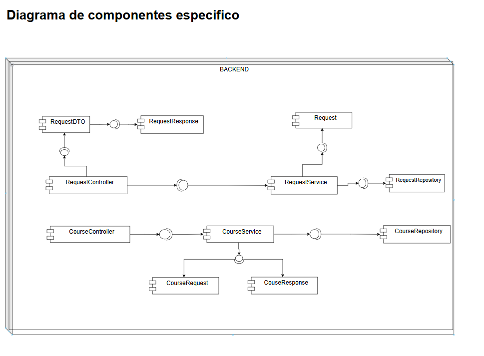

# Squad-genesis-backend-2025-2
___

## Miembros del equipo:

- Sofía Ariza Goenaga
- Carolina Cepeda Valencia
- Marlio Jose Charry Espitia
- Manuel Alejandro Guarnizo Garcia
- Daniel Palacios Moreno

## Estructura del proyecto

## Resumen manejo de las tareas

## Estrategías de gitflow:

---
1. Ramas Principales: 
- main: rama encargada de las releases del sprint
- develop: En esta rama nos encargamos de desarrollar y de integrar las nuevas funcionalidades antes de pasar a main.

2. Otras ramas utilizadas:
* feature/create_courses: Verificamos funcionalidades de crear los cursos.
* feature/request-query: Para implementar la logica de consulta de solicitudes.
* feature/respondRequests: Para desarrollar la parte encargada de resolver las solicitudes.
* feature/unit-tests: Esta fue creada con el fin de llevar a cabo los test necesarios del back.
* prueba1: Esta rama fue temporal con el fin de los primeros bosquejos de codigo que teniamso pensados.
* feature/README: Rama para actualizar o modificar el archivo README del proyecto.
* hotfix/refactorizacion: Rama para correcciones rápidas y mejoras en la estructura del código.
* revert-10-feature/respondRequests: Rama creada para revertir cambios específicos relacionados con la funcionalidad de responder solicitudes.
* feature/pemsum: Rama para implementar o mejorar una funcionalidad específica (detalles no claros por el nombre).
* feature/new-unit-tests: Rama creada para agregar nuevos tests unitarios al proyecto.

# Analisis y diseño
___
### Diagramas de Contexto

### Diagramas de casos de Uso

### Diagrama Componentes General

### Diegrama Componentes Especifico

### Diagrama de Bases de Datos

### Diagrama de clases

### Diagramas de secuencia

#### 1. Login

#### 2. Consultar Solicitudes administrativos

#### 3. Consultar Solicitudes Estudiantes

#### 4. Responder Solicitudes 

### 5. Crear una Solicitud

### 6. Actualizar Status de una solicitud

### 7. Estadísticas de solicitudes

### 8. Obtener todos los cursos

### 9. Obtener un curso por su código

### 10. Crear un curso

### 11. Actualizar los cursos

### 12. Añadir grupo a los cursos

### 13. Eliminar un curso

### 14. Consultar horario

### 15. Obtener Pensum

## Calidad del código
___
### Cobertura de pruebas unitarias

En la sprint número dos se presenta la siguiente cobertura de pruebas unitarias

Se hace aumento de pruebas unitarias, en base a ...

### Calidad del código estático Sonarqube
