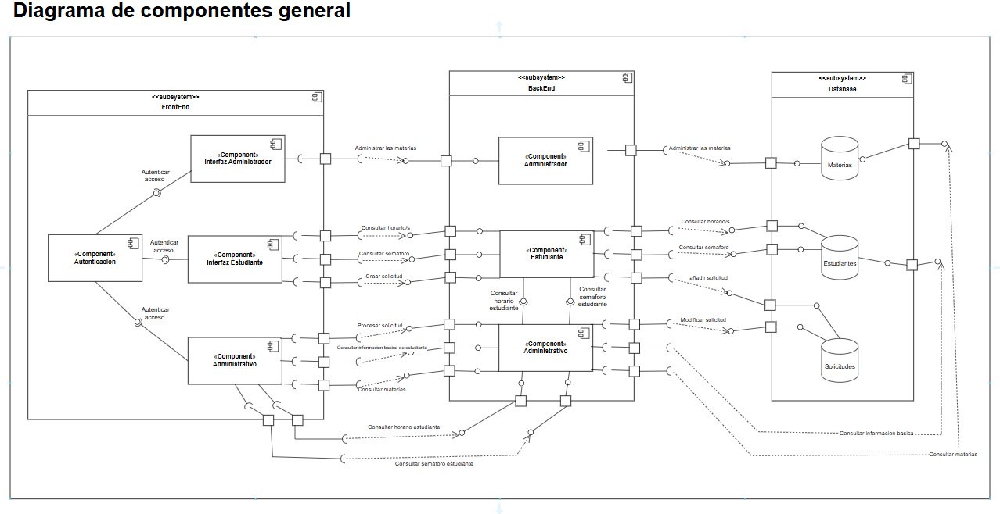

# Squad-genesis-backend-2025-2
Back Proyecto DOSW

## Miembros del equipo:

- Carolina 
- Marlio Jose Charry Espitia
- Manuel Alejandro Guarnizo Garcia

## Estructura del proyecto

## Resumen manejo de las tareas

## Estrategías de gitflow:

1. Ramas Principales: 
- main: rama encargada de las releases del sprint
- develop: En esta rama nos encargamos de desarrollar y de integrar las nuevas funcionalidades antes de pasar a main.

2. Otras ramas utilizadas:
-feature/create_courses: Verificamos funcionalidades de crear los cursos.
-feature/request-query: Para implementar la logica de consulta de solicitudes.
-feature/respondRequests: Para desarrollar la parte encargada de resolver las solicitudes.
-feature/unit-tests: Esta fue creada con el fin de llevar a cabo los test necesarios del back.
-prueba1: Esta rama fue temporal con el fin de los primeros bosquejos de codigo que teniamso pensados.

## Analisis y diseño

### Diagramas de Contexto

### Diagramas de casos de Uso

### Diagrama Componentes General

### Diegrama Componentes Especifico

### Diagrama de Bases de Datos

### Diagramas de secuencia

#### 1. Login

#### 2. Consultar Solicitudes administrativos

#### 3. Consultar Solicitudes Estudiantes

#### 4. Responder Solicitudes 

### 5. Diagrama de clases 

## Pasando a Codigo:

