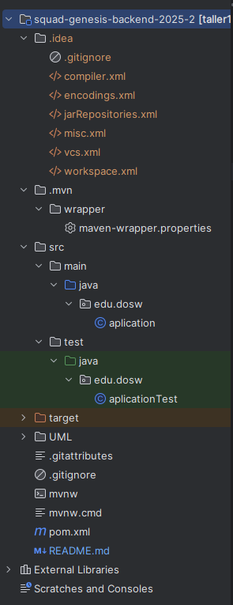

# Squad-genesis-backend-2025-2
Back Proyecto DOSW

## Miembros del equipo:
- Sofía Ariza Goenaga
- Carolina Cepeda Valencia
- Marlio Jose Charry Espitia
- Manuel Alejandro Guarnizo Garcia
- Daniel Palacios Moreno

## Estructura del proyecto

## Resumen manejo de las tareas
Se hace uso de la herramienta Jira para el manejo de tareas.Se manejan
Sprints de 1 semana en los cuales se deciden las tareas a realizar con base en el backlog 
y en estrategia de planning poker se decide el peso de cada una de estas.
https://genesissirha.atlassian.net/jira/software/projects/SIR/boards/1/backlog

## Estrategías de gitflow:

1. Ramas Principales: 
- main: rama encargada de las releases del sprint
- develop: En esta rama nos encargamos de desarrollar y de integrar las nuevas funcionalidades antes de pasar a main.

2. Otras ramas utilizadas:
-feature/create_courses: Verificamos funcionalidades de crear los cursos.
-feature/request-query: Para implementar la logica de consulta de solicitudes.
-feature/respondRequests: Para desarrollar la parte encargada de resolver las solicitudes.
-feature/unit-tests: Esta fue creada con el fin de llevar a cabo los test necesarios del back.
-prueba1: Esta rama fue temporal con el fin de los primeros bosquejos de codigo que teniamso pensados.

## Analisis y diseño

### Diagramas de Contexto
Se representa la interacción entre los actores principales y el sistema SIHRA. Mientras el
estudiante crea solicitudes y observa las respuestas dadas por el administrativo.

### Diagramas de casos de Uso
Se manejan 3 actores: estudiante, administrador y administrativo

El estudiante puede crear solicitudes, consultar su estado e historial, revisar su horario académico
de cualquier periodo actual o pasado y su semáforo académico. Está relacionado con el proceso de
responder solicitudes, ya que visualiza la respuesta a sus requerimientos.

El administrativo tiene funciones más avanzadas como responder solicitudes de su facultad,
registrar materias y grupos, administrar horarios de los estudiantes y configurar periodos habilitados.Consulta
información detallada del estudiante y de los grupos.

### Diagrama Componentes General
El diagrama sigue una arquitectura en tres capas (presentación, logica de negocio y datos),
asegurando una separación de responsabilidades. El frontEnd es la capa de presentación encargada de la
interacción con el usuario, el backEnd es una capa intermedia que maneja la lógica de negocio, procesando las
peticiones provenientes del FrontEnd y comunicandóse con la base de datos para realizar operaciones como añadir, modificar
y eliminar materias, solicitudes, etc.

### Diegrama Componentes Especifico
La aplicación implementa una arquitectura en capas siguiendo el siguiente flujo: Controller -> Service -> Repository -> Database.
Los controladores como Requestcontroller y CourseController reciben las peticiones del usuario, utilizan objetos de transferencia
de datos (DTOs) y retornan las respuestas adecuadas. Los servicios como RequestService y CourseService contienen la lógica de negocio y
actuan entre intermediarios de los controladores y los repositores, donde estos último, gestionan el acceso a la base de datos.

### Diagrama de Bases de Datos
Se muestra la estructura de los documentos NOSQL. Las colecciones principales son las
siguientes:
- historical : historial académio de los estudiantes.
- faculties : información de facultades y sus cursos.
- groups : datos de los grupos (clases).
- sessions : los horarios de las sesiones de clase.
- requests : Solicitudes realizadas por los estudiantes.
- universityMembers : miembros de la universidad ( estudiante, administrativo)

### Diagramas de secuencia

#### 1. Login

#### 2. Consultar Solicitudes administrativos

#### 3. Consultar Solicitudes Estudiantes

#### 4. Responder Solicitudes 

### 5. Diagrama de clases 

## Pasando a Codigo:

### Jacoco build

Sprint 4

### Cobertura Sprint 4

